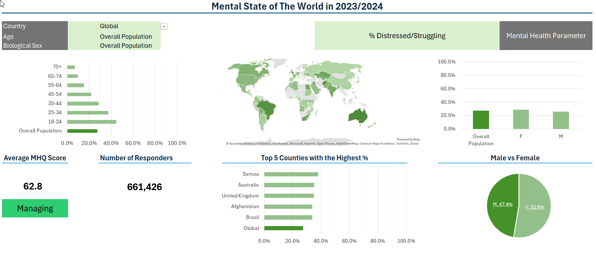
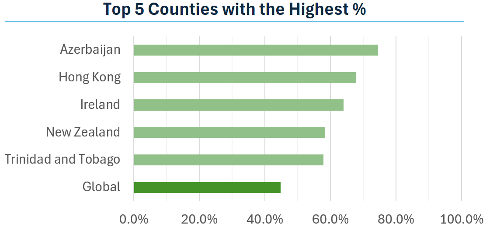
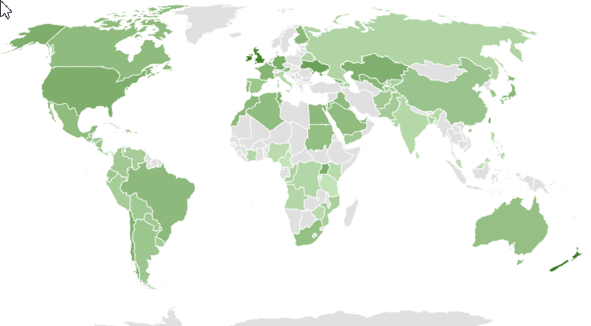

# Excel Mental State of The World Dashboard (2023/24)



## Introduction

This dashboard was created to help people explore the findings from the 2023/24 Mental State of the World report by Sapien Labs.

The dataset includes detailed information on different aspects of mental function across countries, age groups, and biological sexes.

### Dashboard File

My final dashboard is in [Project_Dashboard.xlsx](Project_Dashboard.xlsx).

### Excel Skills Used

The following Excel skills were utilized for analysis:

- **📉 Charts**
- **🧮 Formulas, Functions and Conditional Formatting**
- **❎ Data Validation**

## 🏗️ Dashboard Build

### 📉 Charts

#### 📊 Top 5 Most Affected Countries – Bar Chart



- 🛠️ **Excel Features:** Used bar chart feature with formatted population percentage values and optimised layout for clarity.
- 🎨 **Design Choice:** Chose a horizontal bar chart to clearly show which countries have the highest proportion of people struggling with the selected mental health aspect.
- 📉 **Data Organisation:** Sorted countries in descending order for better readability and kept only the top 5 countries plus the selected country, unless it’s already in the top 5.
- 💡 **Insights Gained:** Helped identify the countries struggling the most with the selected aspect of mental health and compare them with your country of interest.

#### 🗺️ Global Differences – Map Chart



- 🛠️ **Excel Features:** Used Excel’s map chart feature to visualise global trends in mental health.
- 🎨 **Design Choice:** Colour-coded the map to highlight regional differences in the selected mental health parameter.
- 📊 **Data Representation:** Plotted each country’s score based on available data for the selected mental health aspect.
- 💡 **Insights Gained:** Made it easy to spot regional differences and see where mental health outcomes are better or worse.

### 🧮 Formulas, Functions and Conditional Formatting

#### 👥 Average MHQ Score by Country, Age Group and Biological Sex

```
=INDEX(data,
  MATCH(1, (data[Country] = country)*(data[Age] = age)*(data[Biological sex] = sex), 0),
  MATCH("MHQ Score (Average)", data[#Headers], 0)
)
```

- 🔍 **Multi-Criteria Lookup:** Retrieves a value based on a match for country, age, and biological sex.
- 📊 **Array Formula:** Combines `INDEX()` and `MATCH()` to search across multiple columns simultaneously. The multiplication operator `*` is used to simulate an AND condition, so the formula only returns a match when all three criteria are met in the same row.
- 🎯 **Targeted Value Retrieval:** Returns the MHQ Score (Average) for the matching demographic combination.
- 🔢 **Formula Purpose:** Fetches a personalised MHQ Score from the dataset based on user selections.

```
=IFS(AND(C2 >= -100,C2 < -50), "Distressed",
     AND(C2 >= -50,C2 < 0), "Struggling",
     AND(C2 >= 0,C2 < 50), "Enduring",
     AND(C2 >= 50,C2 < 100), "Managing",
     AND(C2 >= 100,C2 < 150), "Succeeding",
     AND(C2 >= 150,C2 < 200), "Thriving")
```

